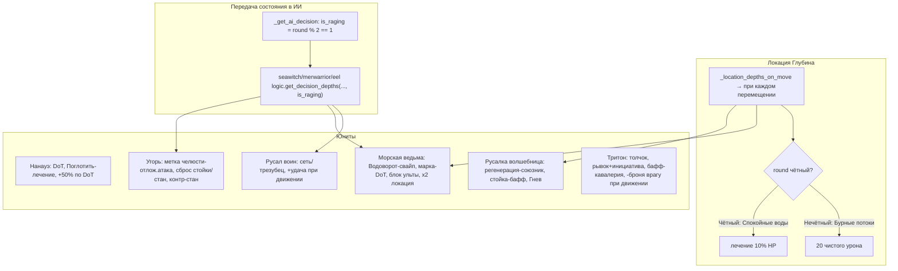

# План: 6 водных юнитов локации «Глубина»

## Сопоставление состояний локации (ИСПРАВЛЕНИЕ названий)
- **Бурные потоки** = нечётный раунд (`current_round % 2 == 1`) = **20 чистого урона** при смене позиции
- **Спокойные воды** = чётный раунд (`current_round % 2 == 0`) = **лечение 10% HP** при смене позиции

В коде сейчас названия инвертированы — исправить в [`_location_depths_label()`](battle_scene.gd:3640) и [`_location_depths_on_move()`](battle_scene.gd:3649).

## Диаграмма новых механик и потоков данных

## Сводка по каждому юниту

### Нанауэ (special_effect_type="nanau_bloodlust")
- **Драть плоть** (0.5): periodic_damage 0.5 × `damage`, 2 хода
- **Учуять кровь** (0 урон, поз.4): self_push_forward 2, self buff crit+30 accuracy+30 на 1 ход
- **Поглотить** (1.3): если у цели есть periodic_damage — отменить его + Нанауэ лечит 30% max_hp
- **Пассивка**: +50% урона по целям с periodic_damage (множитель в расчёте урона)
- **ИИ**: если есть цель с periodic_damage → 70% Поглотить; иначе случайный навык
- Новые эффекты: `consume_periodic_heal` (обработчик в `_use_ability`)

### Русал воин (special_effect_type="merwarrior_move_luck")
- **Поймать в сеть** (0.3, поз.1234→цель34): target_push_forward 1, target_debuff_evasion 30 на 2 хода
- **Пронзить трезубцем** (1.0, поз.1234→цель12): self_push_forward 1
- **Пассивка**: при собственном перемещении → +10 crit на 1 ход (хук в перемещении)
- **ИИ**: Бурные потоки → Поймать в сеть; Спокойные воды → Пронзить трезубцем
- Новое: хук пассивки при self-перемещении

### Русалка волшебница (special_effect_type="mermaid_depth_heal")
- **Вместе с волной** (0 урон, Ally): target_push_forward 1, regeneration 5% на 3 хода
- **Сила моря** (стойка sea_power_stance): все союзники +20 damage, пока активна
- **Гнев океана** (1.0, поз.1234→цель234)
- **Пассивка**: вместо урона от «Бурных потоков» союзники лечатся на столько же (в `_location_depths_on_move`)
- **ИИ**: если живых союзников ≤1 → Гнев океана; иначе случайный
- Новые: stance-аура союзникам, инверсия урона локации

### Морская ведьма (special_effect_type="seawitch_double_depth")
- **Водоворот** (0 урон, All_Enemies): обмен позиций 1↔4, 2↔3; =4 перемещения для локации
- **Глубоководное проклятие** (марка persistent на позицию врага, 2 хода): DoT 0.3×damage на 5 ходов
- **Мрачная сделка** (0 урон): цель +3 инициативы 2 хода + block_ultimate 1 ход
- **Пассивка**: удваивает лечение/урон от локации (множитель 2 в `_location_depths_on_move`)
- **ИИ**: Бурные потоки → Водоворот; иначе если нет марки → Глубоководное проклятие; иначе Мрачная сделка по цели с макс. Величием
- Новые: swap-позиций, марка-DoT, block_ultimate, double-depth

### Угорь (special_effect_type="eel_counter_stun")
- **Двойной укус** (1.0, поз.234→цель123): self_push_forward 1, jaw_mark 1 ход (→ атака 100% в начале след.хода по последней цели)
- **Оплетание** (0.8, поз.123→цель123): target_push_forward 1, breaks_enemy_stances; если у цели не было стойки → стан
- **Пассивка**: при получении атаки 5% шанс стана атакующего; удваивается если угорь двигался в этом ходу
- **ИИ**: Спокойные воды → 70% Оплетание (приоритет по цели в стойке); Бурные потоки → 70% Двойной укус
- Новые: jaw_mark (отложенная атака в `_next_turn`), conditional-stun, counter-stun, флаг moved_this_round

### Тритон (special_effect_type="triton_enemy_move_armor")
- **Удар копт** (1.0, поз.12→цель1): target_push_back 3
- **Только вперёд** (0 урон, поз.34): self_push_forward 2, +4 инициативы 1 ход
- **Морская кавалерия** (0 урон, Self): +20 armor +20 damage на 3 хода
- **Пассивка**: при перемещении врага → он теряет 10 брони на 1 ход (хук в перемещении цели)
- **ИИ**: если нет баффа sea_cavalry → 70% Морская кавалерия; иначе случайный
- Новые: hook «враг переместился» → дебафф брони

## Новые поля в Combatant
- `ultimate_blocked: bool` — блок ульты (Мрачная сделка)
- `jaw_mark_target: Combatant` — цель отложенной атаки угря
- `moved_this_round: bool` — флаг движения в текущем ходу (Угорь)
- Сброс `moved_this_round` в `start_new_round()`

## Новые обработчики в battle_scene.gd
1. `_swap_enemy_positions()` — обмен 1↔4, 2↔3 + 4× `_location_depths_on_move`
2. jaw_mark атака в `_next_turn` (как stance-триггеры)
3. `consume_periodic` (Поглотить) + множитель урона по DoT-целям
4. hook пассивок на перемещение: merwarrior (+crit), triton (враг -armor), eel moved_flag
5. инверсия/удвоение в `_location_depths_on_move` (mermaid heal, seawitch x2)
6. stance-аура «Сила моря» (как kappa_auras, в `_start_new_round`)
7. block_ultimate проверка в `_on_ultimate_clicked`
8. исправление названий Бурные/Спокойные воды

## Файловая структура
- `Enemies/Civilization/Depth/<Unit>/` — способности + персонаж (категория определить)
- `Enemy_logic/<unit>_logic.gd` — 6 AI-скриптов

## Этапы (см. todo-список)
1. Изучить mark/shift-систему + правка названий вод
2. Расширить Combatant (новые поля)
3. Нанауэ: 3 спос. + пассивка + ИИ
4. Русал воин: 2 спос. + пассивка + ИИ
5. Русалка волшебница: 3 спос. + пассивка + stance-аура + ИИ
6. Морская ведьма: 3 спос. + swap + марка-DoT + блок ульты + double-depth + ИИ
7. Угорь: 2 спос. + jaw-mark + conditional-stun + counter-stun + ИИ
8. Тритон: 3 спос. + пассивка + ИИ
9. 6 character .tres
10. Регистрация 6 ИИ в `_get_ai_decision` (+ is_raging)
11. Кодовая поддержка всех механик в battle_scene.gd
12. Компиляция EXIT=0
